# The Continuous Delivery at Criteo

Meetup - June 21, 2017

---

# Agenda

.big[
&nbsp;

1. A 9 years old history

2. How to reinvent your pipeline?

3. Towards a better CD

4. The CD implementation at Criteo
]

???
1. Main steps of the last 9 years
2. How we change our piprline at Criteo
3. Ideal pipeline from a theortical point of view
4. Concretely at Criteo

First, a few words about me and Criteo

---

# About me &mdash; Emmanuel Debanne

&nbsp;

## Until now
- 2002: Canon (Print software)
- 2009: ThePresentFriend (Gift recommendation)
- 2010: Ullink (Trading software)
- 2012: [Criteo](http://www.criteo.com/) (Online Advertising), QA, DevTools

## Some links
- [Github](https://github.com/debanne)
- [Linkedin](https://www.linkedin.com/in/emmanuel-debanne-40577835/)

---

class: split-50
# About Criteo

_"Real-Time Digital Advertising That Works"_

.left-column[
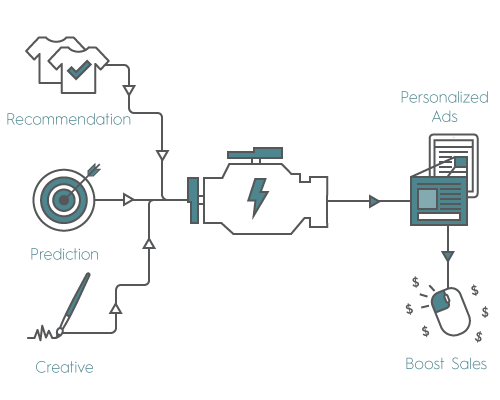
]
--

.right-column[
- 130 countries

- 11K advertisers

- 16K publishers

- Listed on the NASDAQ since October 2013

- 90% retention rate

- R&D: 21% of the workforce
]

???
Among others, Criteo proud of retention rate

---
layout: true
# A bit of history

---

- __2005__: Criteo is founded
- __2008__: Start to grow
???
Who did not found a start-up about recommendation?
--

- __2011__: Weekly integration of branches, 90 min to build
???
A big part of the build was related to the checkout. Bash scripts calling MSBuild.
--

- __2012 June__: Weekly integration lasts 6 working days

--

&nbsp;&nbsp;&nbsp;&nbsp;&nbsp;&nbsp;&rarr; The mono-repo is split. Nugets are introduced.
???
Lot of work to decide about ownership of each repo.

--

- __2012 November__: 1 month to update a library.
--

- __2012 December__: Deployment freeze
--

- __2013 April__: 4 months to catch up

--

&nbsp;&nbsp;&nbsp;&nbsp;&nbsp;&nbsp;&rarr; Build from Source (BFS) is introduced.
<br>
&nbsp;&nbsp;&nbsp;&nbsp;&nbsp;&nbsp;&rarr; Dedicated project is created.

--

- __2013 Q2 to Q4__: Migration to BFS:
  - Add missing tests
  - Catch up nuget lag
  - Create the tooling
???
No new features during several months.

---

&nbsp;

- And iterate:

.center[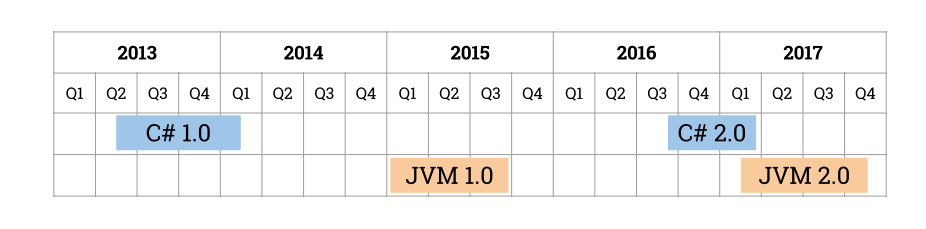]

---

.center[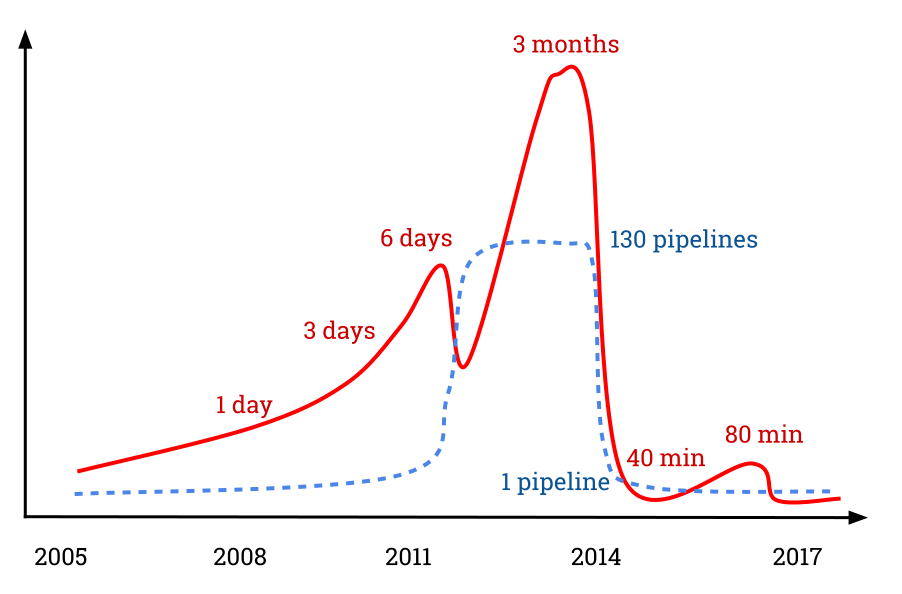]

---

&nbsp;

&nbsp;

&nbsp;

.center[
# Questions?]

---

layout: true
# How to change?

---

- Be endorsed by the management

???
Whole dedication of the R&D is needed to: adapt the code, increase code coverage.

--

- Have a dedicated team

???
The change will take time:
- weeks of planning,
- months of engineering.

The team proposes plans for:
- implementation,
- migration

The project requires a real owner:
- get the whole picture,
- support other teams,
- advocate and commit to a solution.

--

- Have the right level of competence

???
Knowledge about a configuration management tool - like Chef or Puppet - will be necessary to setup the build cluster.<br>
Optimization of builds may require a good knowledge of build tools.

--

- Deliver the same quality as for other products

???
Performance issues to solve.<br>
Right code coverage is required as the tooling will be maintained and updated in the coming years.

--

- Define the right frontier between the CD team and the other teams:

???
Right level of responsabilties is necessary. Of course devs should still be allowed to modify the build of their projects.

--

 - Allow customization that don't jeopardize the future
--

 - Allow changes but under supervision
--

 - Be owner of key parts

---

&nbsp;

&nbsp;

&nbsp;

.center[
# Questions?]

---

layout: true
# Towards an ideal pipeline

---

&nbsp;

&nbsp;

.center[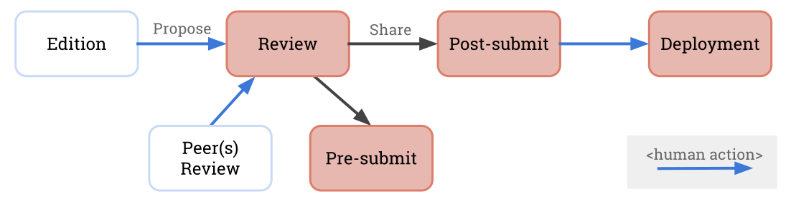]

???
High level representation of a CD pipeline.

The main interface from the point of view of the user is the review.

"Pre-submit" and "post-submit" terms come from the Gerrit tool. Pre-submit means "before-sharing", "pre-merge"...

The goal of the pre-submit is to avoid bad and late surprises in the post-submit. It is a gatekeeper before the code is shared.

---

&nbsp;

&nbsp;

Important qualities of a CD pipeline:

- scalable

--

- fast

--

- safe

--

- developer friendly

???
Let's see each of this point in detail.

---

layout: true
# Ideal pipeline: Scalable

---

## Dependency hell

.smaller_breath[
Usually, with multiple repos, each repo is built independently from the others. Versioned artifacts are published and used as dependencies.

This leads to the dependency hell:
- Difficult to upgrade a dependency in all repos.
- Several different versions to upgrade (or patch if an upgrade is too risky).
]

--

## Solved by _building from source_

With the "build from source" paradigm, dependencies are no more versioned &mdash; as nugets or Maven artifacts &mdash; but are built from source.

---

layout: true
# Ideal pipeline: Scalable (&rarr; BFS)

---

&nbsp;

.smaller_breath[
Advantages of BFS:]
- Enforcement of a unique version among all clients.
- Smoother upgrades (both for internal and external libraries).
- Earlier discovery of issues.

&nbsp;&nbsp;&nbsp;&nbsp;&nbsp;&nbsp;&nbsp;&nbsp;&rarr; Allows to scale!

--

.smaller_breath[
Drawbacks of BFS:]
- More difficult to change an internal or external library (in the short term).
- Require to use "feature toggles" for progressive roll-out.
- Need to handle flaky tests.
- Can break the build of all repos (limited thanks to "partial" builds and a "fast revert" policy).

???
## Transition
Is everyone convinced we need BFS?<br>
Let's see how to implement it from multi repositories...

---

&nbsp;

Situation before BFS, with independent repos:

.posimg[
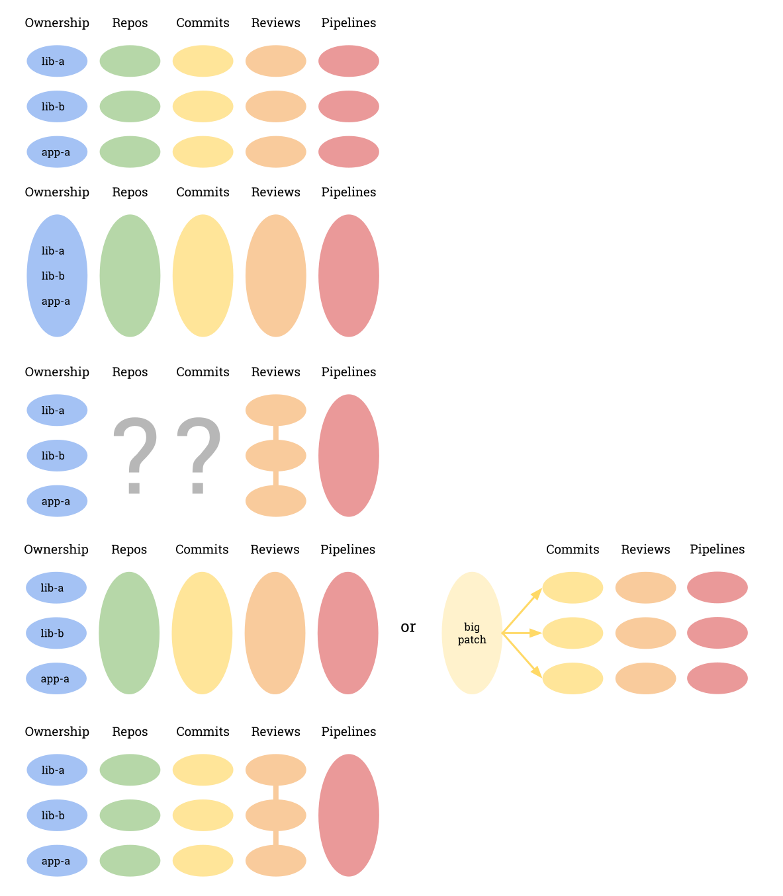
]

???
As an example, we considerate 3 pieces of code that are owned by 3 different teams.

--

&nbsp;__Exercise:__ How to migrate to BFS?

???
## Transition
If you've been to DevoXX, or if you visit the website about "trunk based development" (wher Google, Facebook, Netflix, Uber (iOS app) are mentioned), the response is quite obvious.

---

&nbsp;

Advertised as solved by a mono-repo:

.posimg[

]
--

But what about the ownership and fine-grained reviews?

---

Actually, what we need is:
- fined-grained ownership/reviews
- a way to test and merge a big change on the whole code base

.posimg[

]
---

.small_breath[
At Google:]

.posimg[

]
--

At Criteo:

.posimg[

]

---

&nbsp;

| Features requiring tooling                | Mono-repo | Multi-repos |
| ----------------------------------------- |:---------:|:-----------:|
| Partial checkout/build (on dev's machine) | &#x2713;  | &#x2713;    |
| Complete checkout (on CI builders)        | -         | &#x2713;    |
| Reviews/commits relationships             | &#x2713;  | &#x2713;    |
| Ownership                                 | &#x2713;  | (optional)  |
| Support of open-sources repos             | &#x2713;  | -           |
| Secrecy of sensitive data                 | &#x2713;  | -           |
| Fast checkout                             | &#x2713;  | -           |

???
## Transition
Big mono-repos are difficult to maintain. Git was designed for the Linux kernel, but some companies have a much larger code base.

---

## About repo performance

What is a big big repo?

|             | Linux kernel | Facebook | Windows | Google                       |
| ------------|-------------:|---------:|--------:|-----------------------------:|
| Nb of files | 60 K         |   200 K  |  3.5 M  |    9 M (no data, conf, doc)  |
| Nb of lines | 20 M         |    65 M  |   50 M  | 2000 M                       |
.right[<i>(caution: rough estimates...)</i>]

???
estimations for HEAD of some mono-repos.

---

.center[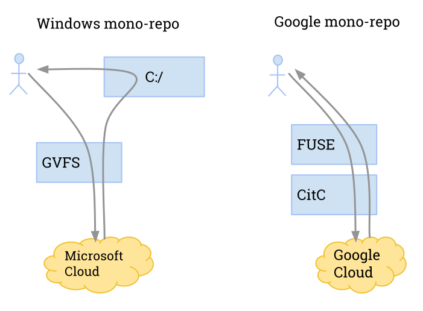]

---


&nbsp;

&nbsp;


.center.bigger[

## Conclusion

BFS does not require a mono-repo
]

--

.center.bigger[
BFS does require tooling
]

???
##Transition
- Who is applying BFS?
- Who is applying BFS with a mono-repo?
- Who is applying BFS with multiple repos?
- Who would like to apply BFS with a mono-repo?
- Who would like to apply BFS with multiple repos?

---

layout: false
# Ideal pipeline: Safe

## Be exhaustive

- Put the build environment and external dependencies into one of the built-from-source repo.

???
New compiler, new external dep: should be validated at presubmit.

--

## Execute the right tests

- Question: Where should you test that _"the application should start"_ ?

--

- Ideally all tests should be run at presubmit<br>
  &nbsp;&nbsp;&nbsp;&nbsp;&nbsp;&nbsp;&nbsp;&rarr; Forget about usual categories: Unit, Functional, Integration, etc.

--

<!--
https://latex.codecogs.com/eqneditor/editor.php
\begin{matrix}
ROI(test) \sim p_{failure} \, \frac{cost(broken\ postsubmit)}{cost(test\ execution\ in\ presubmit)}\\
\\
ROI(test) \sim p_{failure} \, \frac{duration(failing\ pipeline) \cdot nb(impacted\ developers)}{duration(test)}
\end{matrix}
-->

.center[]

???

---

#Ideal pipeline: Fast

.big[
&nbsp;

&nbsp;

Presubmits &le; ... min

Revert &le; 10 min

Commit to prod availability &le; 1 hour
]

???

---

layout: true
#Ideal pipeline: Developer friendly

---

Make your clients autonomous by providing:
   - trainings
   - exhaustive and empowering documentation

--

Examples of documentation pages:

- Creating a Git repository
- Working with IntelliJ
- Creating a hotfix
- Adding an external dependency
- Upgrading an external dependency

<i>Even trivial things should be documented!</i>

???
Do not mix user manual with your own internal doc.

---

Easy to use:
.smaller[
- Provide smart tooling.
  - to bootstrap a project
  - to upgrade dependencies
  - to checkout the clients of your code
  - etc.
]

???
Not all developers like to go deep into .csproj, pom.xml. This requires skills.<br>
The tooling can check the projects, provide guidance...

--

.smaller[
- Allow pipeline extension by providing helpers.<br>
  Example:

```groovy
 `filerHelper.upload`(commitsFilename, "${newMoabPath}/commits.json")
```
]

???
Common pieces are mutualized (credential usage, priority management, user rights, ...)

---

Easy to use:
.smaller[
- Provide a DSL for easier integration into the pipeline.<br>
  Example:

```groovy
ContinuousIntegration.`jmoab`Project {
    gerritProject(`'identification/cactus'`) {
        replicateTo('git@gitlab.criteois.com:identification/cactus.git')
    }

    marathonApp(`'cactus'`) {
        continuous`Preprod`Deployment {
            configureTestingJob {
                steps {
                    shell("""\
                        [...]
                        """.stripIndent())
                }
            }
        }
    }   
}```  
]

???
Easier than to have to know about idempotency, timeouts, clean-up, failure emails, logs rotation, script language...

---

&nbsp;

&nbsp;

Easy to fix:

- Provide precise feedback about failures (pin-point the failing commits).

- Propose or perform auto-reverts.

---

layout: false
# Towards an ideal pipeline

&nbsp;

&nbsp;

&nbsp;

.center[
# Questions?]

---

layout: true
# The CD implementation at Criteo

---

## Content

- The code base
- The MOABs
- Partial checkouts
  - In C#
  - In Maven
  - In Gradle
- The SQL projects
- Optimized build
- Encountered issues with BFS
- Job scheduler
- The pipeline of the CD infrastructure
- The deployment to prod

---

&nbsp;

&nbsp;

Our code base is mainly made of 3 pipelines:

|            | Repositories | Projects | Tools/Services/Apps |
| -----------|-------------:|---------:|--------------------:|
| C#         | 130          | 1000     | 120                 |
| Java/Scala | 240          | 500      | 190                 |
| Chef       | 150          | -        | -                   |

---

&nbsp;

.center[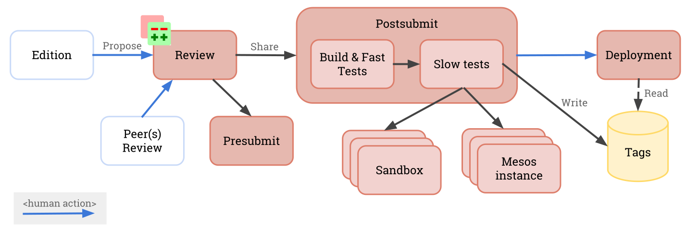]

---

layout: true
# CD at Criteo: The MOABs

---

.center[MOAB = build of all repos taking the last HEADs]

.moab_from_heads_2[
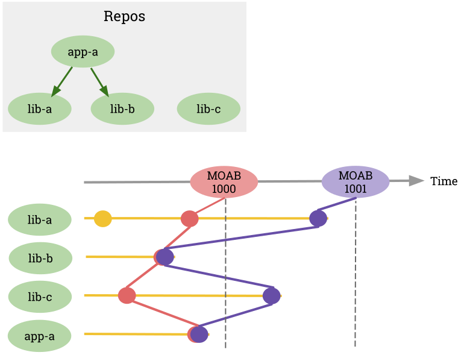
]

???
MOAB is mother of all builds, not Massive Ordonance Air Blast, nor Mother of All Bombs.

This is what occur in the post-submit: all repos are built from source together.

## Transition
This is what occurs on the CI buiders. Now let's focus on the developer's machine.

---

.moab_from_heads_1[

]

"app-a" can be built with its dependencies:

.small_breath[```bash
bfs checkout --with-dependencies app-a```]
&nbsp;&nbsp;&nbsp;&nbsp;&nbsp;&nbsp;&rarr; Clone the repositories according to the dependency graph of the last MOAB.<br>
<br>
--

Or, with MOAB artifacts, by doing a partial checkout:

.small_breath[```bash
bfs checkout app-a```]

---

.center[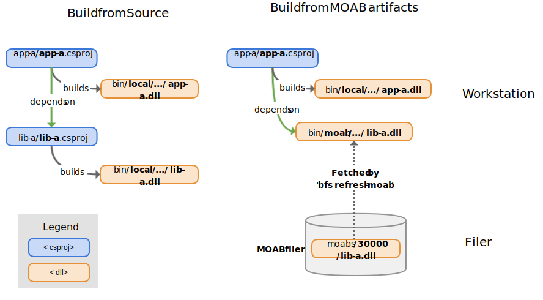]

---

## MOABs are partially _green_

|               | lib-a           | lib-b           | lib-c           |
| --------------|:---------------:|:---------------:|:---------------:|
| MOAB 1000     | .green[&#x2714;]| .green[&#x2714;]| .green[&#x2714;]|
| __MOAB 1001__ | .green[&#x2714;]| .green[&#x2714;]| .red[&#x2718;]  |
| MOAB 1002     | .green[&#x2714;]| .red[&#x2718;]  | .green[&#x2714;]|


## Upgrade of internal dependencies

.small_breath[```bash
bfs refresh-moab```]
&nbsp;&nbsp;&nbsp;&nbsp;&nbsp;&nbsp;&rarr; Fetch the artifacts of the most recent MOAB: __1001__.

---

layout: true
# CD at Criteo: Partial checkout

---

&nbsp;

Avoids to:

- checkout all the code base

- rebuild everything

- have a huge solution in the IDE

- get a broken source code

---

&nbsp;

## Implementations

- C#

- Maven

- Gradle

---

layout: true
# CD at Criteo: Partial checkout with __C&#35;__

---

### Expression of internal dependencies

.smaller_breath[<code>apps/app-a/app-a.csproj</code>:
```xml
<ItemGroup>
    <Reference Include="`lib-a`" />
</ItemGroup>
```]

???
app-a dependson lib-a.dll<br>
The directory of the MOAB artifacts is part of the search paths.

--

### Priority of local artifacts over MOAB artifacts

```xml
<AssemblySearchPaths>
    $(`LocalBinariesFolder`);$(`MoabCacheFolder`);$(AssemblySearchPaths)
</AssemblySearchPaths>
```

---

### Project Graph

```solution
Project = "`lib-a`",
          "libs\lib-a\lib-a.csproj",
          "{0000000-0000-0000-0000-0000000000}"
EndProject
Project = "`app-a`",
          "apps\app-a\app-a.csproj",
          "{1111111-1111-1111-1111-1111111111}"
    ProjectSection(ProjectDependencies) = `postProject`
        {0000000-0000-0000-0000-0000000000} = {0000000-0000-0000-0000-0000000000}
    EndProjectSection
EndProject
```

```xml
<Target Name="CopyBuildOutput" AfterTargets="Build">
    <`Copy` SourceFiles="$(TargetPath)" Destination="$(`LocalBinariesFolder`)" />
</Target>
```

???
The tool used to build on the CI and to create the solution on dev's machine parses the .csproj and decides the build order of the projects.<br>
This is done by matching the required DLLs with the assemblies built by the local .csproj.<br>
The artifacts of a project are provided to the other projects by copying them in a priority directory.<br>
This directory is the first one of the artifact search paths.<br>

---

layout: true
# CD at Criteo: Partial checkout with __Maven__

---

### Expression of internal dependencies

.smaller_breath[<code>apps/app-a/pom.xml</code>:
```xml
<project>
  <artifactId>app-a</artifactId>
  <version>1.0</version>

  <dependencies>
    <dependency><artifactId>`lib-a`</artifactId></dependency>
    <dependency><artifactId>lib-b</artifactId></dependency>
  </dependencies>
</project>
```]

.smaller_breath[<code>libs/lib-a/pom.xml</code>:
```xml
<project>
  <artifactId>`lib-a`</artifactId>
  <version>`1.0`</version>
</project>
```]

---

### Priority of local artifacts over MOAB artifacts

.smaller_breath[
Bill of material (BOM) of MOAB 1000:
.smaller[
```xml
<project>
  <artifactId>moab</artifactId>
  <version>1000</version>
  <packaging>pom</packaging>
  <dependencyManagement>
    <dependencies>
      <dependency><artifactId>`lib-a`</artifactId><version>`1000`</version></dependency>
      <dependency><artifactId>lib-b</artifactId><version>1000</version></dependency>
      <dependency><artifactId>app-a</artifactId><version>1000</version></dependency>
    </dependencies>
  </dependencyManagement>
</project>
```]
]

???
The MOAB BOM (bill of material) is generated at each MOAB.<br>
It is called BOM to make it clear it is only providing version numbers.<br>
It declares the built artifacts for a given MOAB in the "dependencyManagement" section.

---

.smaller[
```xml
<project>
  <modules>
    <module>lib-a</module>
    <module>app-a</module>
  </modules>

  <dependencyManagement>
    <dependencies>
     <!-- Import the MOAB BOM -->
      <dependency>
        <artifactId>moab</artifactId>
        <version>1000</version>
        <scope>`import`</scope>
        <type>pom</type>
      </dependency>

      <!-- Force the checked-out projects to be considered locally -->
      <dependency><artifactId>`lib-a`</artifactId><version>`1.0`</version></dependency>
      <dependency><artifactId>app-a</artifactId><version>1.0</version></dependency>
      <!-- Version of lib-b is taken from the MOAB BOM -->
    </dependencies>
  </dependencyManagement>
</project>
```]

???
The pom at the workspace root declares the modules (repos), and import the BOM of a MOAB.<br>
The artifacts of the MOAB are at version 1000. Those locally compiled are at version 1.0 (convention).

---

layout: true
# CD at Criteo: Partial checkout with __Gradle__

---

### Expression of internal dependencies

.smaller_breath[<code>apps/app-a/build.gradle</code>:
```gradle
dependencies {
    compile name: '`lib-a`', version: '`1.0`'
}
```]

---

### Priority of local artifacts over MOAB artifacts

.smaller[
```gradle
Map<String, Project> modulesToProject = [
    '`lib-a`': `project`(':libs/lib-a'),
     ...
]
subprojects {
    configurations.all {
        resolutionStrategy {
            // Executed after all projects are read
            dependencySubstitutions.all { dependencySubstitution ->
                String moduleId = "${it.requested.group}:${it.requested.module}"
                Project dependentProject = modulesToProject.get(moduleId)
                if (dependentProject != null) {
                    `dependencySubstitution.useTarget(dependentProject)`
                }
            }
        }
    }
}
```]

???
The Gradle scripts know which artifact is built for each project. A map associating artifacts and the projects that build them can be computed.

Gradle allows to define substitution rules. Thus, a dependency to an artifact can be replaced by a dependency to a project. This works in the IDE too.

---

layout: false
# CD at Criteo: The SQL projects

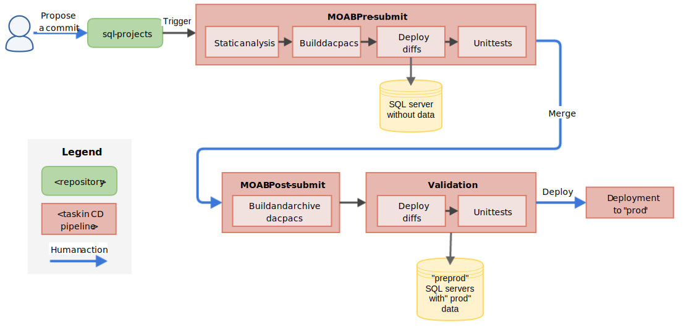

---

layout: false
class: split-30
# CD at Criteo: Optimized build

.left-column[
.smaller_breath[.center[Dependency graph]

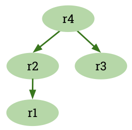
]
__Exercise:__ How to build and test this?
]

--

.right-column[
.smaller_breath[.center[Parallelized build]

.graph_img_2[
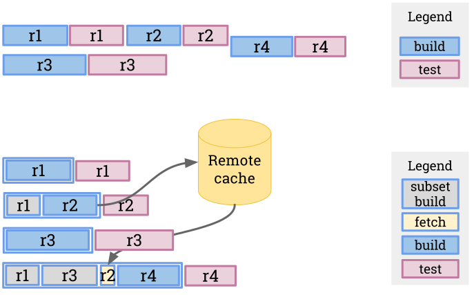
]
]
]
--

.right-column[
.smaller_breath[.center[Distributed build]

.graph_img_3[

]
]
]

???
r2 has already been compiled, so it can be taken from the cache.

---

layout: false
# CD at Criteo: Issues with BFS

&nbsp;

- The pipeline __cannot be branched__.

???
Branches might be legitimate for big changes in the pipeline (e.g. new compiler) that should be completely tested (including a deployment in prod).

--

- A review that impacts many repositories require __many rebase__ iterations.

--

- BFS is not easily polyglot and able to deal with dependencies of multiple languages (JS, Python...)

???
A tool is needed to discover the dependencies between repos and implement the partial checkout.<br>
We did it on bower dependencies for front-end projects.

--

- Flaky tests.

--
&nbsp;__Exercise:__ How to get rid of flaky tests?
???
Of course you will have flaky testes. We have 65 000 unit tests for example.
--

 - Retry until they pass.
--

 - Or retry until they fail.
--

 - Or provide reports.

???
Reports can be provided by running the tests 100 times to detect the flaky ones and send reports every 2 weeks for instance.

---

layout: true
# CD at Criteo: Job scheduler

---

&nbsp;

&nbsp;

&nbsp;

- 1 Jenkins server and 92 builders (Linux/Windows/Mac)

--

- 2500 jobs expressed with the Job DSL plugin

--

- 30K executions / day

---

The jobs of the MOAB pipeline: 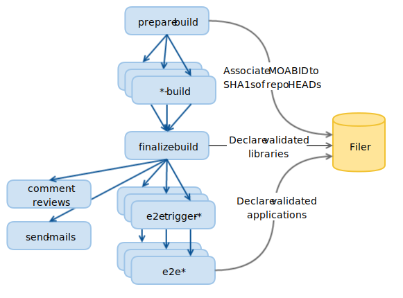

???
- prepare-build: associate a MOAB id to the set of sha1s of the heads of all repos
- *-build: compile and test a repo
- finalize-build: aggregate the results
- comment-reviews: send a feedback in the reviews
- send-mails: warn about failing commits
- e2e-triggers-*: check the state of the test environment
- e2e-*: execute the e2e tests for each app
--

&nbsp;__Question__: How to execute a prepare-build if many e2e-* jobs are still queued? 

---

.smaller[
No dedicated machines thanks to the Priority Sorter plugin
- Weighted Fair Queuing
- Interleave the jobs
- Improved Round-Robin
]

???
- replaces the default FIFO queue in Jenkins.
- defines the execution rate of a job compared to the other jobs.
- inspired by an algorithm used for network or CPU schedulers.

--

class: split-40
.job_tables[
.left-column[
| Job name   | Priority |
|:-----------|---------:|
| hotfix     | 1        |
| presubmit  | 10       |
| e2etest    | 50       |
]

.right-column[
| Job name |BUILD_ID | Queue order |
|:---------|--------:|------------:|
|presubmit |100      | 1010|
|presubmit |101      | 1020|
|e2etest   |300      | 1021|
|presubmit |102      | 1030|
|presubmit |103      | 1040|
|hotfix    |200      | 1041|
|hotfix    |201      | 1042|
|presubmit |104      | 1050|
|presubmit |105      | 1060|
|presubmit |106      | 1070|
|e2etest   |301      | 1071|
|...       |...      |...  |
]
]

---

.smaller[__Exercise:__
<code>finalize-build</code> has been executed with MOABs 1000, 1001, 1002. <code>e2e-my-slow-tests</code> with MOAB 1000 is still executing.<br>
How to by-pass execution with MOAB 1001 and execute directly with MOAB 1002?
]

--

.smaller_breath[Cancel job with MOAB 1001 and trigger a new one with MOAB 1002:
```groovy
def nextJob = Jenkins.instance.getJob('e2e-my-slow-tests')
def qeued = nextJob.queueItem
queued.do`Cancel`Queue()
def params = [new StringParameterValue('MOAB_ID', build.resolve('MOAB_ID'))]
nextJob.`scheduleBuild2`(0, new Cause.UpstreamCause(build), params)
```]

--

.smaller_breath[Better: Replace job in order to not lose order:
```groovy
if (queued != null) {
    queued.`replaceAction`(params)
} else {
    nextJob.`scheduleBuild2`(0, new Cause.UpstreamCause(build), params)
}                                                                                                                                           
```]

---

layout: true
# CD at Criteo: Pipeline of the infra

---

The CD cluster is managed by Chef &mdash; as for the production clusters.

???
We talked about the CD but not about the infra that allows to run the CD.

This infra also has a CD pipeline.

This is the same kind of pipeline as for our 20000+ machines in prod.

--

- 16 nodes in "preprod"
- 168 nodes in "prod"
- 3 datacenters

--

Detail of the "prod":
- 92 builders: 30 Linux, 58 Windows, 4 Mac
- 34 sandboxes made of 2 hosts: 1 Linux + 1 Windows
- Gerrit
- Jenkins
- Nexus
- Filer
- SonarQube
- and instances for resilience

---

2 kind of repositories:

- 140 repos "Shared cookbooks": When a commit is merged, a commit that bumps the cookbook version is automatically proposed as a review in the repositories that manage chef clusters.

- 8 repos "Chef clusters": Apply "shared cookbooks" and "cluster cookbooks" to a set of nodes.

---

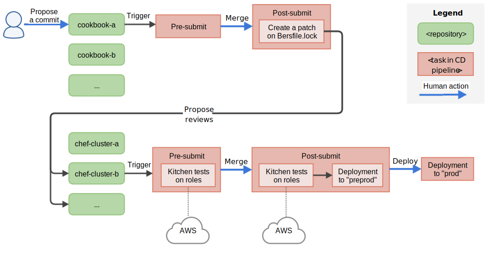

???
A "prod" branch exists to push to prod.

A knife plugin called "knife-deploy" has been developed to validate the convergence.<br>
It updates the Chef server and checks the convergence of all non-downtimed nodes.

---

&nbsp;

&nbsp;

&nbsp;

__Exercise:__ Does this pipeline implement "Build from source"?

---

layout: true
# CD at Criteo: The deployment

---

Same principles as the CI pipeline:
- Suppress toil
- Allow scaling

--

A dedicated application keep track and trace of:
- what is in production
- where
- since when
- why

---

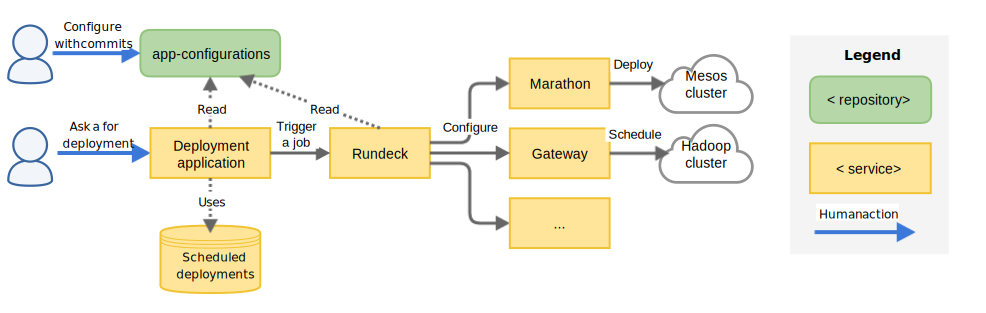

App configurations are in a repository, produced thanks to a DSL.

Deployment is monitored via checks of SLOs.


---

layout: false
# Questions?

&nbsp;

&nbsp;

&nbsp;

&nbsp;

.bigger[.center[Thanks for your attention!]]

&nbsp;

&nbsp;

&nbsp;

<!--_Slides made with [remark](https://github.com/gnab/remark/)._-->
